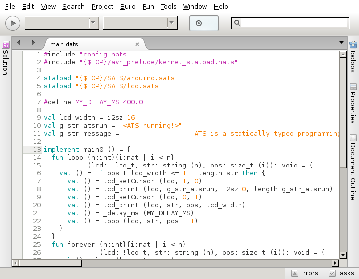

ATS IDE
=======

The goal is to create a newer IDE for ATS.

To compile:

1. Install Mono 3.x and MonoDevelop 5.x (see instructions from mono-project.com)

2. Open the solution and compile to dll in Debug mode

3. Open the terminal emulator of your choice and type the following:

$ mdtool setup pack MonoDevelop.ATSBinding/MonoDevelop.ATSBinding.addin.xml

4. There should be a file named MonoDevelop.ATSBinding_V.mpack (where
V stands for version, e.g. 0.0.1), which you can install into
MonoDevelop via the GUI menu: Tools -> Add-in Manager -> Install from
file.

5. The plugin should just work.
